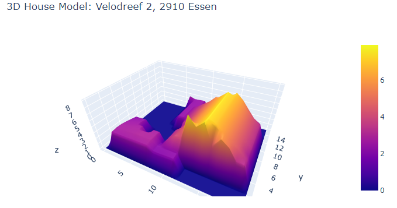

# 3D House Project
## Table of Contents
1. [Description](#description)
1. [Objectives](#objectives)
	1. [Challenges](#challenges)
	2. [Limitations](#limiatations)
	3. [Further developments](#further-developments)
1. [Repo Architecture](#repo-architecture)
1. [Installation](#installation)
1. [Usage](#usage)
1. [Visuals](#visuals)
1. [Timeline](#timeline)
1. [Personal situation](#personal-situation)

## Description
This project is a part of the Becode.org AI Bootcamp programme. The goal is to produce a 3D plot of a house situated in Flanders, Belgium with only the address of the house provided.

## Objectives

- to be able to search and implement new libraries
- to be able to read and use the [shapefile](https://en.wikipedia.org/wiki/Shapefile) format
- to be able to read and use geoTIFFs
- to be able to render a 3D plot
- to be able to present a final product

### Challenges

* research required to understand how to handle geospatial data, such as handling raster and vector data structures and their attributes (e.g. for raster data - bands and for vector data - polygon extent) and metadata, such as: coordinate reference systems (CRS), EPSG., ...
* research and use of the Python libraries for handling geospatial data and plotting a 3D model

### Limitations
* limited time to deliver the project
* outdated data available for the region of Flanders - DSM and DTM files available for the region were created in 2014, therefore it is not possible to plot a model of any building created afterwards. 

### Further Developments
* organizing the code into Classes
* improving the efficiency of the code (currently it takes a few minutes to retrieve information from the DSM and DTM files)
* extending the search area to the whole country of Belgium
* improving the 3D plot

## Repo Architecture

3D House Project

* **README.md**          : explains the project
* **requirements.txt**   : lists libraries installed in the environment in which the project was created 
* **main.py**            : Python script file with the add plotting a 3D Canopy Height Model of a house for the provided address in Flanders, Belgium.
* **retrieve_bounds.py** : Python script file necessary to create a .csv file containing bounds of 43 GeoTIFF files storing geospatial information of the Flanders region of Belgium as well as links to the respective DSM and DTM files available in a zippped folders on the [Geopunt.be](https://www.geopunt.be/) website (it is not necessary to rerun this file as the product of it DTM_bounds.csv file is provided in the repo and main.py is accessing it directly)
* **DTM_bounds.csv**     : .csv file, which stores info containing bounds of 43 GeoTIFF files storing geospatial information of the Flanders region of Belgium as well as links to the respective DSM and DTM files available in a zippped folders on the [Geopunt.be](https://www.geopunt.be/) website.

## Installation

`git clone` this repository into your local environment. Make sure you installed all dependencies mentioned in the requirements.txt.

## Usage

To use the program, run 'python main.py' in your environment via the command line. The program will ask you to provide a valid address for a house in Flanders, Belgium. Your input should be in the following order: "<street><house number>, <postcode><municipality>" (the same format is used, e.g. by Google Maps). The output is a Canopy Height Model (CHM) of a given house plotted with Plotly. The whole process may 

## Visuals
This is an example of a plotted 3d model of a house: 

## Timeline

The duration of the challenge was 8 working days.

- Deadline: `04/11/21 17:00 PM`

## Personal situation

I am currently participating in the Becode.org AI Bootcamp to upskill into a career in data science.

**[Back to top](#table-of-contents)**